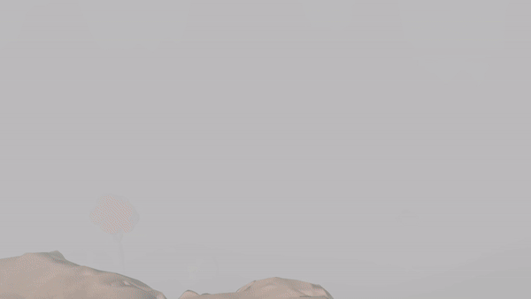

# Interactive OpenGL Environment

## Overview

The goal of this project is to create an interactive OpenGL environment where users can navigate through a virtual scene, viewing objects from any desired angle, and manipulating various parameters such as fog and light angles.


## Features

- **Interactive Navigation**: Users can navigate the scene using keyboard controls (WASD, arrow keys) and mouse input to move the camera in 3D space and change its orientation.
- **Lighting Control**: Ambient light direction can be adjusted using the L and J keys, while a central light generates shadows for objects in its vicinity.
- **Parameter Manipulation**: Users can increase or decrease fog intensity (F and G keys), reveal shadow computation map (M key), and trigger automatic camera movement along Bezier curves (B key).
- **Speed Control**: Holding LSHIFT enables a "sprint" mode, greatly increasing camera navigation speed.
- **Threaded Animation**: Separate thread controls camera movement along spline-based curves.


## Scene Description

The virtual scene includes:
- Farm area with hills and terrain variation.
- Mountains acting as borders.
- Rocky hill, rocks, trees, and fences with cows.
- Dynamic lighting and shading effects.


## Code Overview

1. **Model Loading and Rendering**: Utilizes custom Model3D class to load and render level, trees, and skybox.
2. **Shaders and Uniforms**: Defines shaders for different objects and passes necessary parameters via uniforms.
3. **Depth Maps and Shadow Mapping**: Generates depth map texture to create shadows.
4. **Scene Rendering**: Renders the scene using appropriate shaders and applies shadows using light-space transformation matrix.
5. **Skybox Rendering**: Renders the skybox using a cubemap shader.
6. **User Input Handling**: Captures keyboard and mouse input for camera movement and parameter adjustments.
7. **Threaded Animation**: Controls camera movement along spline-based curves using a separate thread.


## User Manual

- **WASD**: Move camera in X and Z axes.
- **LCTRL/SPACEBAR**: Move camera in Y axis.
- **LSHIFT**: Hold for increased movement speed.
- **Arrow Keys**: Adjust camera orientation.
- **F/G**: Increase/Decrease fog intensity.
- **J/L**: Rotate ambient light direction.
- **M**: Reveal shadow computation map.
- **B**: Trigger Bezier curve camera movement.
- **Mouse**: Look around the scene.




## Cloning

To get a local copy of this project up and running on your machine, simply clone this repository using Git:

```sh
git clone https://github.com/AndreiE91/OpenGL_Application.git
cd OpenGL_Application
```

Open and build the project in Visual Studio afterwards.


